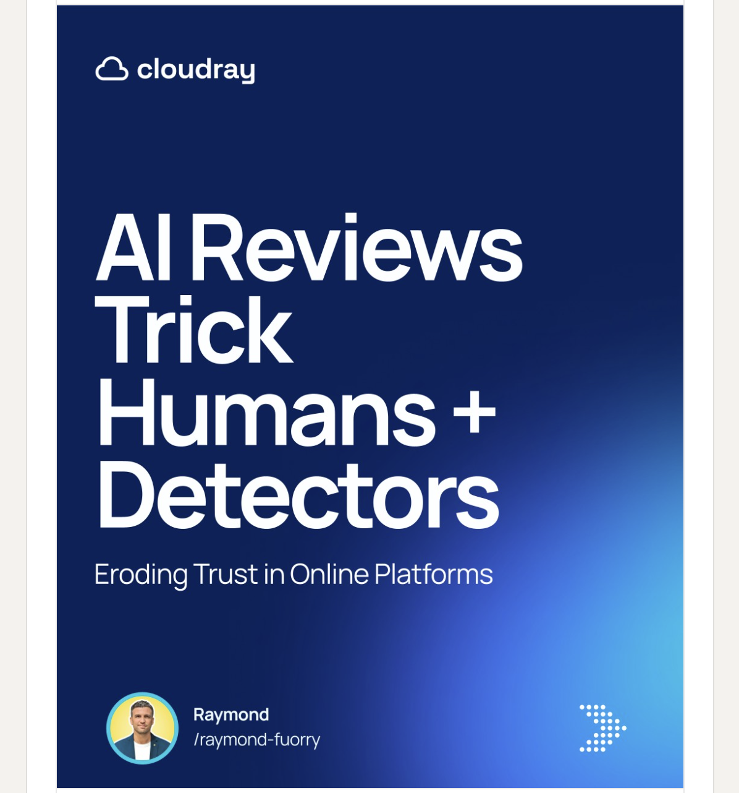

**Feed2Figma: Automated LinkedIn Carousel Creation with AI**
============================================================

**Overview**
-----------

Feed2Figma is an automated workflow that generates engaging LinkedIn carousels from RSS feeds using AI-powered content generation. This project leverages Python, LangChain, and Bing Image Creator (Dalle-3) to create high-quality carousel content, and integrates with Google Sheets and Figma for seamless content management.

**Features**
------------

* Automated carousel creation from RSS feeds
* AI-powered content generation using LangChain
* Image generation using Bing Image Creator (Dalle-3)
* Integration with Google Sheets for data management
* Integration with Figma for template design and auto-population
* Python scripts for web scraping, data processing, and content generation

**Getting Started**
---------------

### Prerequisites

* Python 3.x
* LangChain library
* Bing Browser
* Google Service Account Credentials
* Figma LinkedIn Carousel Template

### Usage

1. Run the `rss_feed_scraper.py` script to fetch the RSS feed and extract article content
2. Run the `langchain_generator.py` script to generate the carousel content and image descriptions
3. Run the `google_sheets_uploader.py` script to upload the content to Google Sheets
4. Update the Figma template with the new content using the `figma_updater.py` script

**Scripts**
---------

* `rss_feed_scraper.py`: Fetches the RSS feed and extracts article content
* `langchain_generator.py`: Generates the carousel content and image descriptions using LangChain
* `google_sheets_uploader.py`: Uploads the content to Google Sheets
* `figma_updater.py`: Updates the Figma template with the new content

**License**
-------

This project is licensed under the MIT License. See the `LICENSE` file for details.

**Contributing**
------------

Contributions are welcome If you'd like to contribute to Feed2Figma, please fork the repository and submit a pull request.

**Acknowledgments**
---------------

* LangChain library for AI-powered content generation
* Bing Image Creator (Dalle-3) for image generation
* Google Sheets and Figma for cloud-based collaboration tools
